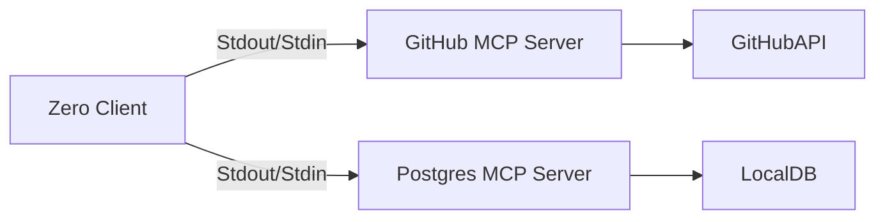

# Model Context Protocol (MCP) Integration

> [!WARNING]
> **Status: PLANNED / EXPERIMENTAL**
> This feature is currently in the design phase.

**MCP (Model Context Protocol)** allows Zero to connect to external data sources (GitHub, Linear, Notion, PostgreSQL) and tools without building custom integrations for each one. Zero acts as an **MCP Client**.

## 1. Architecture



Zero discovers available resources and tools from these servers and dynamically adds them to the Agent's tool belt.

## 2. Configuration (`mcp_config.json`)

We will use a standard configuration file to manage connections:

```json
{
  "mcpServers": {
    "github": {
      "command": "npx",
      "args": ["-y", "@modelcontextprotocol/server-github"],
      "env": {
        "GITHUB_PERSONAL_ACCESS_TOKEN": "..."
      }
    },
    "filesystem": {
      "command": "npx",
      "args": ["-y", "@modelcontextprotocol/server-filesystem", "/Users/me/Documents"]
    }
  }
}
```

## 3. Integration Strategy

1.  **Discovery:** On startup, `src/orchestrator/mcp_manager.py` reads config and spawns server processes.
2.  **Tool Conversion:** MCP Tools (e.g., `github_create_issue`) are wrapped as LangChain/LangGraph compatible tools.
3.  **Resource Mounting:** MCP Resources (e.g., `github://repo/readme`) can be read directly into the context.

## 4. Use Cases

*   **"Summarize the latest PRs on our repo"** -> Uses GitHub MCP.
*   **"Check my calendar for conflicts"** -> Uses GCal MCP.
*   **"Query the prod database for user X"** -> Uses Postgres MCP.
